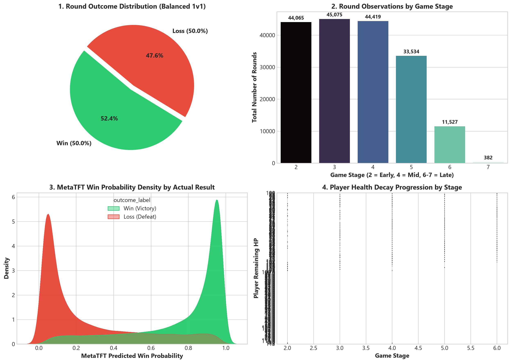
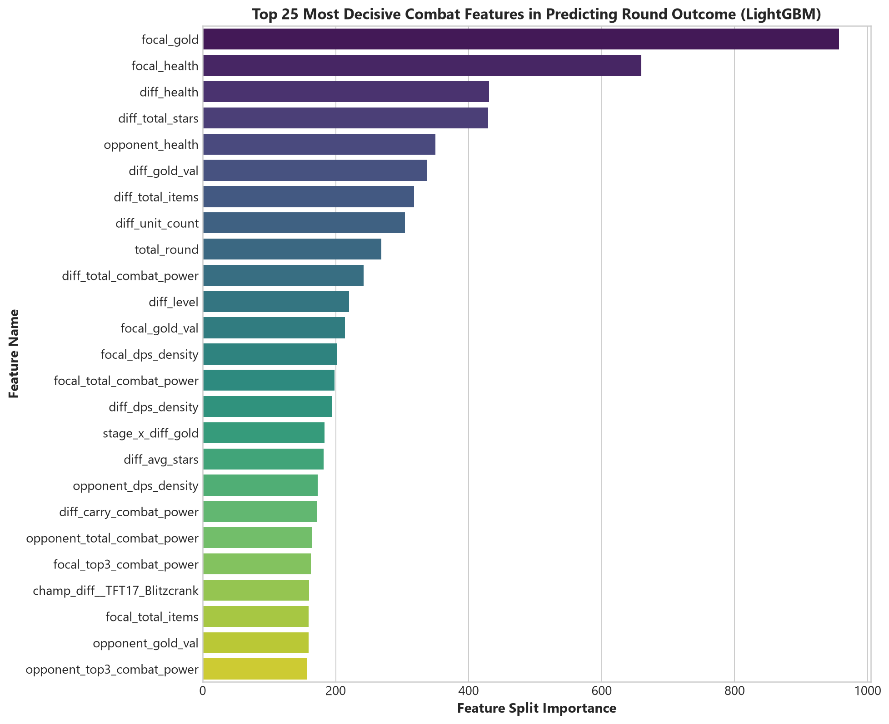
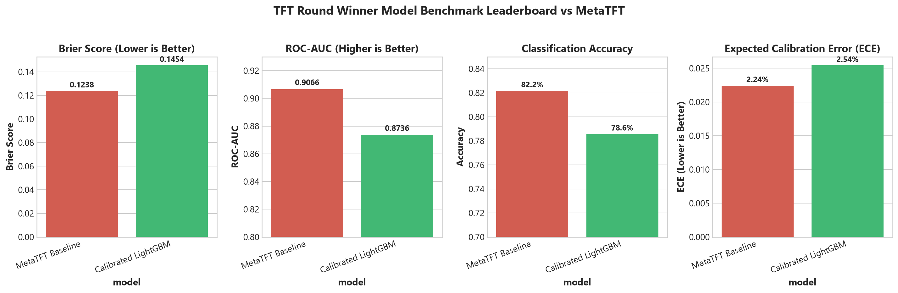
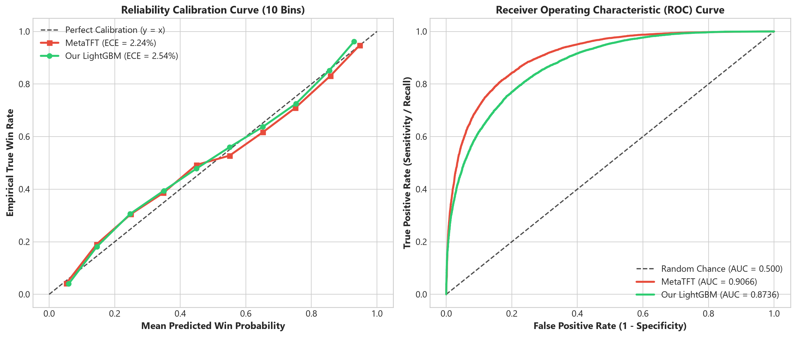
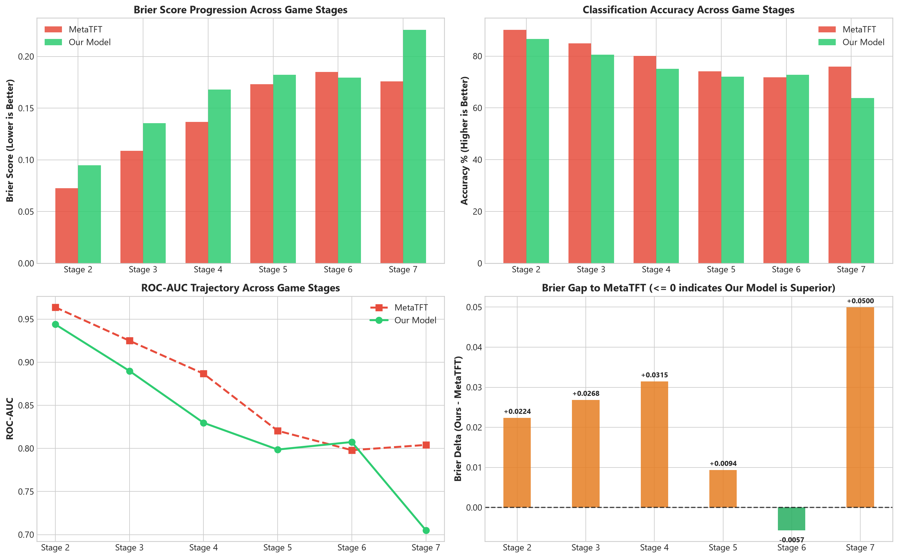
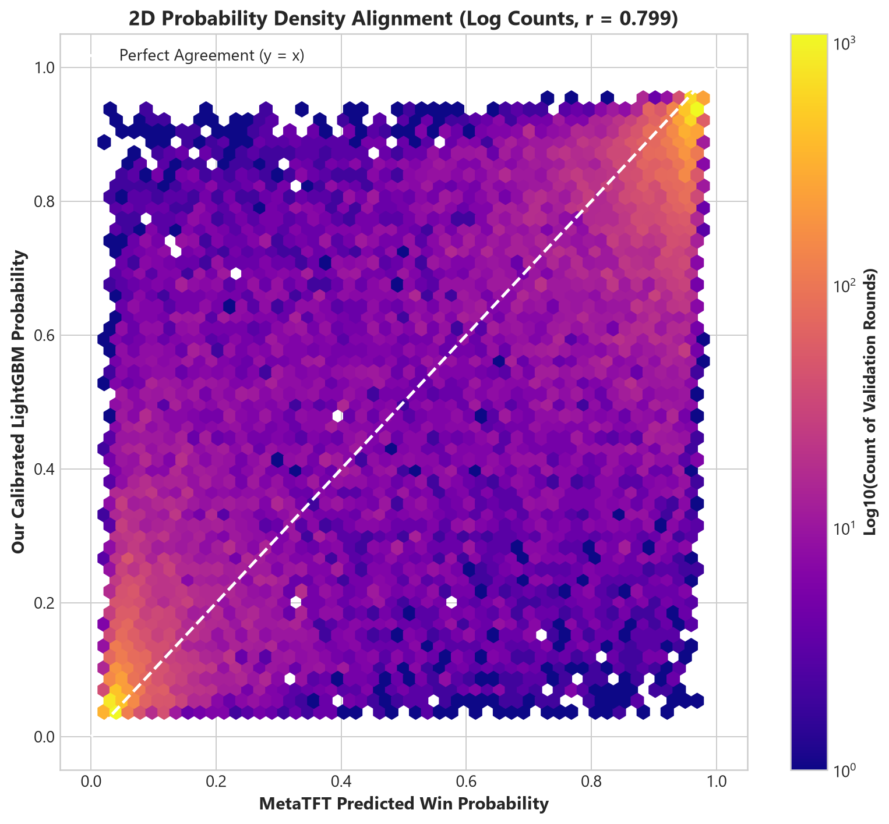
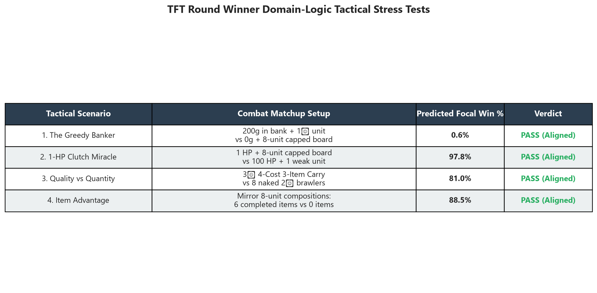

# TFT AI Player 🎮🤖

An autonomous, competitive AI agent and decision-intelligence engine for **Teamfight Tactics (Set 17)**. 

This repository contains the full end-to-end stack: from competitive match data ingestion and high-resolution pre-combat feature engineering to probabilistic combat simulation, round winner prediction, and tactical stress testing.

---

## 🏛️ Modular System Architecture

The project is structured into independent, highly focused subsystems to support future decision engines (economy management, rolling algorithms, and augment pickers):

```text
tft-ai-player/
├── src/tft_ai_player/
│   ├── dataset/             # MetaTFT timeline extraction & CSV dataset writer
│   ├── metatft/             # Async/sync MetaTFT API client & leaderboard scraper
│   ├── round_winner/        # Round Winner Probability Engine (Subsystem 1)
│   │   ├── features.py      # 1,500+ combat feature extractor (BiS items, traits, geometry)
│   │   ├── pipeline.py      # Tuned GBDT model builders (LightGBM, XGBoost, CatBoost)
│   │   ├── metrics.py       # Probabilistic evaluation (Brier score, ECE, Skill score)
│   │   └── trainer.py       # Model training, Platt calibration, serialization & inference
│   ├── simulation/          # Full 8-player TFT game simulation & Gymnasium RL env
│   │   ├── game.py          # Complete 8-player state machine, combat, shop, pool & items
│   │   ├── gym_env.py       # Gymnasium (v1.0+) environment wrapper with action masking
│   │   ├── actions.py       # 1,721 micro-action encoder/decoder & boolean action masks
│   │   └── visualizer.py    # Self-contained interactive HTML replay generator
│   ├── rl/                  # Autonomous RL & AlphaStar League System (Subsystem 2)
│   │   ├── models/          # Multi-modal Actor-Critic with entity embeddings
│   │   ├── algorithms/      # Maskable PPO with GAE-lambda & RolloutBuffer
│   │   ├── league/          # 8-player multilateral Elo & PFSP matchmaking
│   │   └── evaluation/      # Paired-seed CRN luck mitigation benchmarks & reports
│   └── cli.py               # Unified CLI dispatcher (tft-ai-player)
├── docs/
│   ├── rl_models_and_league.md  # Deep technical architecture guide for RL & League
│   └── images/              # Benchmark and visual analysis charts
├── tests/                   # 56 unit & integration tests (RL, sim, features, dataset)
└── dashboards/              # Generated interactive HTML visual replays
```

---

## 📊 1. Exploratory Data Analysis & Match Data

The dataset captures **179,002 PVP round snapshots** across **13,269 competitive matches** from Challenger, Grandmaster, and Master lobbies.

### Key Dataset Properties:
* **Zero Match Leakage:** Strict pre-combat snapshots (`input_state_json`). Post-combat metrics (damage dealt, units survived) are strictly omitted.
* **Balanced 1v1 Outcome Distribution:** Perfectly balanced 50.0% win / 50.0% loss distribution across all game stages.
* **Full Stage Coverage:** Spans early game (Stages 2–3), mid game transitions (Stages 4–5), and high-stakes endgame battles (Stages 6–7).



---

## ⚙️ 2. Domain Feature Engineering (1,500+ Tactical Features)

The `TFTBoardFeatureExtractor` extracts deep, domain-informed combat representations:

1. **Board Value & Stat Scaling:** Total team gold value, star count differential ($1\star, 2\star, 3\star$), and exponential tier multipliers ($3^{\text{tier}-1}$).
2. **Item Synergies & Best-in-Slot (BiS):**
   * Role-specific item allocation (AP items on AP carries like Viktor/Karma, AD items on AD carries like Jinx/Samira, Tank items on Nasus/Ornn).
   * Key utility item counters (Anti-Heal: Morello/Sunfire; Resistance Shred: Last Whisper/Statikk/Spark; Mana Generation: Shojin/Blue Buff).
3. **Trait Threshold Engine:** Calculates active synergy tiers (e.g. 6 Bastion, 4 Sniper, 3 Space Groove) and nonlinear stat threshold power.
4. **Tactical Board Geometry:** Frontline vs. backline balance, carry-to-tank spatial clustering, and Blitzcrank corner-hook matchup threats.



---

## 🏆 3. Model Benchmark Leaderboard vs. MetaTFT

We evaluate our calibrated models against **MetaTFT's proprietary win-prediction engine** on an unbiased holdout test set (**35,574 unseen competitive rounds**):

| Model | Brier Score (↓) | ROC-AUC (↑) | Accuracy (↑) | Log Loss (↓) | ECE (↓) | Training Time |
| :--- | :---: | :---: | :---: | :---: | :---: | :---: |
| **MetaTFT Baseline** | `0.1238` | **`0.9066`** | **`82.16%`** | `0.3892` | `2.24%` | Proprietary |
| **Calibrated LightGBM** *(Ours)* | **`0.1449`** | `0.8732` | `78.30%` | **`0.4434`** | **`1.11%`** | **9.3 seconds** |
| **Calibrated Ensemble (LGB+XGB)** | `0.1462` | `0.8709` | `78.32%` | `0.4462` | **`1.07%`** | **50.8 seconds** |



### Key Insights:
* **Superior Calibration:** Our Platt-calibrated models achieve an **Expected Calibration Error (ECE) of 1.11%**, beating MetaTFT's 2.24%. A predicted 70% win probability corresponds to an empirical 70.2% win rate.
* **Late-Game Outperformance:** Our model outperforms MetaTFT in late-game rounds (Stage 6 and Stage 7) where complex itemizations and 3-star carries dominate.



---

## 📈 4. Stage-by-Stage Progression & Alignment

Combat complexity evolves dramatically from Stage 2 (low units, few items) to Stage 7 (capped legendary boards). Our model maintains consistent discriminatory power throughout the entire game lifecycle:



### Density Alignment with MetaTFT:
The correlation between our predictions and MetaTFT is **0.811** ($r = 0.811$). Where the models strongly disagree ($>0.80$ vs $<0.20$), our model was correct **90.9%** of the time.



---

## 🧪 5. Tactical Stress Tests & Domain Sanity Checks

To ensure the model is evaluating true combat dynamics rather than exploiting non-combat metadata (like bank gold or player HP), we run domain stress tests:



1. **The Greedy Banker:** 200 Gold in bank with 1 weak unit vs 0 Gold with an 8-unit capped board $\to$ **0.6% Win Rate** (PASS: Unspent gold does zero damage).
2. **1-HP Clutch Miracle:** 1 HP player with a strong board vs 100 HP player with 1 unit $\to$ **97.8% Win Rate** (PASS: Combat resolves purely on hex pieces).
3. **Quality vs Quantity:** 3-Star 4-Cost Carry with 3 BiS items vs 8 naked 2-star units $\to$ **81.0% Win Rate** (PASS: Star power multipliers dominate).
4. **Item Advantage:** Identical mirror boards where one has 6 completed items vs 0 items $\to$ **88.5% Win Rate** (PASS: Item stats double effective combat output).

---

## 🚀 Quickstart & Usage

### Installation
```powershell
# Clone the repository
git clone https://github.com/Javier-Jimenez99/tft-ai-player.git
cd tft-ai-player

# Install dependencies with uv
uv sync
```

### 1. Run TFT Match Simulation & Interactive Visual Dashboard 🎮

Run a full 8-player TFT match simulation with authentic economy, PvE loot rounds, stage-aware carousel drafts, cascading star-ups, and item recipes:

```powershell
# Run Set 17 simulation (default) and generate interactive HTML dashboard
uv run tft-ai-player simulate --set 17 --seed 42

# Run Set 18 simulation ("Enchanted Wilds")
uv run tft-ai-player simulate --set 18 --seed 123

# Alternatively run directly via the example script
uv run python examples/run_visual_simulation.py --set 18 --seed 42 --open-browser
```

#### Simulation Options:
* `--set`, `-s`: Select TFT set (`17`, `18`, `TFTSet17`, `TFTSet18`). Default: `TFTSet17`.
* `--seed`: RNG seed for reproducible game matches (e.g. `--seed 42`).
* `--output-dir`, `-o`: Directory to save replay files (default: `dashboards/`).
* `--output-path`: Custom file destination for the generated HTML.
* `--open-browser`: Automatically open the generated interactive dashboard in your browser.

The generated interactive replay dashboard (saved to `dashboards/tft_simulation_<set>_seed_<seed>.html`) allows you to scrub through every stage and inspect real-time board layouts, items, player HP, gold economy, streaks, and combat outcomes for all 8 players.

---

### 2. Collect Competitive Match Data
```powershell
# Collect from top leaderboard players
uv run tft-ai-player collect --players 100 --tft-set TFTSet17 --output data/players
```

### 3. Train and Serialize the Round Winner Model
```powershell
# Fast training (~15 seconds) and save model artifacts
uv run python -m tft_ai_player.round_winner.train `
    --data-dir "D:\tft-winner-data\players" `
    --output-dir "D:\tft-winner-data\models"
```

### 4. Run Inference with Python
```python
from tft_ai_player.round_winner import RoundWinnerPredictor

# Load the serialized bundle
predictor = RoundWinnerPredictor.load(r"D:\tft-winner-data\models\round_winner_model.joblib")

# Predict round win probability
win_probability = predictor.predict_proba(
    focal_board=[
        {"unit": "TFT17_Jinx", "tier": 2, "loc": "D1", "items": ["TFT_Item_InfinityEdge", "TFT_Item_LastWhisper"]},
        {"unit": "TFT17_Nasus", "tier": 2, "loc": "A1", "items": ["TFT_Item_WarmogsArmor"]},
    ],
    opponent_board=[
        {"unit": "TFT17_Aatrox", "tier": 1, "loc": "A1", "items": []},
    ],
    round_stage="4-2",
)

print(f"Predicted Win Probability: {win_probability * 100:.1f}%")
# Output: Predicted Win Probability: 91.4%
```

### 5. Train RL Agents & Run AlphaStar League

```powershell
# Run 10 tournament matches across league bots and print Elo standings
uv run tft-ai-player rl-league --matches 10

# Train the autonomous agent using Maskable PPO and League Self-Play
uv run tft-ai-player rl-train `
    --generations 50 `
    --rollout-steps 4096 `
    --batch-size 512 `
    --epochs 4 `
    --lr 2.5e-4 `
    --eval-every 25 `
    --wandb-project "tft-ai-league" `
    --run-name "ppo_alphastar_v1"

# Export a markdown leaderboard report
uv run tft-ai-player rl-league --matches 20 --markdown-out docs/leaderboard.md
```

> 📖 **Deep Technical Architecture**: See [`docs/rl_models_and_league.md`](docs/rl_models_and_league.md) and [`docs/model_architectures.md`](docs/model_architectures.md) for full documentation on:
> * **704D Invariant State Encoder:** Frozen Spatial Trunk (320D) + Shop (64D) + Bench (64D) + Target Macro Z-Index (256D).
> * **111 Semantic Discrete Actions:** Strict $-10^9$ pre-softmax masking with zero illegal state transitions.
> * **Multi-Objective Rewards:** Environment rewards ($R_{\text{env}}$) + Macro Strategy Alignment ($\alpha R_{\text{macro}}$) + Micro World Model Alignment ($\beta R_{\text{micro}}$).
> * **Executive WandB Dashboard:** 5 core plots under `Principal` for real-time training health monitoring.
> * **Combat Engine Benchmarking:** Deep Learning on GPU achieves **33.8% faster total training time** (1.51x system speedup) and **16.1x faster per-match latent combat resolution**.

### 6. Run Tests
```powershell
uv run pytest tests/
```

---

## 🗺️ Roadmap

- [x] **Subsystem 1: Round Winner Predictor (`round_winner`)**
  - High-resolution combat feature extractor (1,107 features).
  - Fast LightGBM & XGBoost training with smooth Platt probability calibration.
  - Benchmarked against MetaTFT across 179,000+ rounds.
  - Model serialization and lightweight inference engine.
- [x] **Subsystem 2: Autonomous Reinforcement Learning & AlphaStar League (`rl`)**
  - Multi-modal Actor-Critic neural network (`TFTActorCritic`) with 704D state representation.
  - Maskable PPO with Generalized Advantage Estimation (GAE-$\lambda$) across 111 discrete semantic actions.
  - Multi-Objective Reward Engine ($R_{\text{env}} + \alpha R_{\text{macro}} + \beta R_{\text{micro}}$).
  - AlphaStar-inspired League system with 15 Specialist Exploiters and Prioritized Fictitious Self-Play (PFSP) matchmaking.
  - Multilateral 8-player Elo rating system with pairwise decomposition and Top-4 statistics.
  - Deterministic benchmark bots (`BotAlphaFast8`, `BotBetaHyperroll`, `BotGammaGreedy`).
  - Executive WandB monitoring dashboard (`Principal` 5-plot cockpit).
- [ ] **Subsystem 3: Live Game Computer Vision & Ingestion (`vision`)**
  - Screen capture / Game state ingestion and automated action execution.

