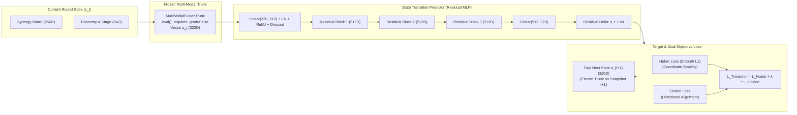

# TFT State Transition Predictor (Offline Behavioral Cloning Engine)

## 1. Executive Summary & Core Motivation

The **State Transition Predictor** acts as our offline behavioral cloning and macro-trajectory prediction engine. Rather than forcing an end-to-end model to learn raw champion IDs, item combinations, board spatial tokens, and economic scalars all at once, we map human imitation learning to a clean, deterministic vector-to-vector regression task ($s_t \to \hat{s}_{t+1}$) mapped entirely within our pre-trained **320D latent representation space** ($\mathbb{R}^{320}$).



---

## 2. The Architectural Formulation

### 2.1 The Frozen Feature Trunk
The state transition predictor takes advantage of the pre-trained `MultiModalFusionTrunk`:
- **Mode:** Strictly evaluated in `.eval()` mode with `requires_grad = False` across all parameters.
- **Stability Guarantee:** Freezing the trunk locks the geometric coordinate system of the 320D latent manifold. The transition predictor learns state transformations over a fixed reference frame, completely eliminating the "moving target" regression instability that occurs when training encoders and transition heads end-to-end.

### 2.2 Deep Residual MLP Architecture
Because TFT macro-transitions from round $t$ to round $t+1$ typically preserve much of the core board composition while applying strategic augmentations (upgrades, positioning adjustments, level-ups, minor pivots), the network uses a **Residual MLP** formulation:

1. **Input:** $s_t \in \mathbb{R}^{320}$ (the player's current frozen multi-modal embedding).
2. **Input Projection:**
   $$\mathbf{h}_0 = \text{Dropout}(\text{ReLU}(\text{LayerNorm}(\mathbf{W}_{\text{in}} s_t + \mathbf{b}_{\text{in}}))) \in \mathbb{R}^{512}$$
3. **Residual MLP Blocks (3–4 Layers):**
   Each block preserves feature representations with residual connections:
   $$\mathbf{h}_{k} = \text{ReLU}\Big(\mathbf{h}_{k-1} + \text{Dropout}\big(\mathbf{W}_{k,2} \text{LayerNorm}(\text{ReLU}(\mathbf{W}_{k,1} \mathbf{h}_{k-1}))\big)\Big)$$
4. **Residual Delta Projection:**
   $$\Delta s_t = \mathbf{W}_{\text{out}} \mathbf{h}_K \in \mathbb{R}^{320}$$
   $$\hat{s}_{t+1} = s_t + \Delta s_t$$

This formulation enables the model to focus its parameter capacity on learning the *round-to-round delta* ($\Delta s_t$) while intrinsically maintaining base board identity.

---

## 3. The Data Pipeline & Strict PvP Transition Filtering

### 3.1 Strict PvP Round Masking
A critical prerequisite for behavioral cloning in TFT is filtering out non-player-driven transitions:
- **Stage 1 Creep Rounds (1-1, 1-2, 1-3, 1-4):** Automatically excluded. Early creep rounds feature automatic unit placement and static AI encounters.
- **Carousel Rounds ($x$-4 in Stages 2–6):** Automatically excluded. Carousel phases disrupt standard shop/re-roll mechanics.
- **Neutral Monster Creep Rounds ($x$-7 in Stages 2–6):** Krugs (2-7), Wolves (3-7), Raptors (4-7), Dragon/Herald (5-7), Elder (6-7) are excluded.
- **Standard Planning & Shopping Phases:** Transitions $(s_t, s_{t+1})$ are retained *only* when both snapshots represent genuine player-driven planning and PvP combat rounds.

### 3.2 Match Partitioning (Grouped by Match ID)
To avoid temporal data leakage (where a model memorizes the specific meta-composition of a game from training snapshots and predicts subsequent rounds in the validation set), data splitting is strictly grouped by `match_id`:
- Unique matches are shuffled and partitioned into Train (85%) and Validation (15%).
- Zero snapshots from validation matches exist in the training partition.

---

## 4. The Dual-Objective Loss Function

Because the pre-trained latent space was shaped by both classification (Top-4 Placement, Combat Win Probability) and contrastive flow (InfoNCE), the transition predictor must capture both the **coordinate magnitude** and the **angular direction** of the next state:

$$\mathcal{L}_{\text{Transition}} = \mathcal{L}_{\text{Huber}}(\hat{s}_{t+1}, s_{t+1}) + \lambda \cdot \mathcal{L}_{\text{Cosine}}(\hat{s}_{t+1}, s_{t+1})$$

```
             ┌────────────────────────────────────────────────────────┐
             │       L_Transition = L_Huber + λ * L_Cosine            │
             └───────────────────┬────────────────────────────────────┘
                                 │
            ┌────────────────────┴────────────────────┐
            ▼                                         ▼
   1. Huber Loss (Smooth L1)                 2. Cosine Directional Loss
   - Coordinates absolute distance           - Angular direction in InfoNCE space
   - Robust to 7-unit Challenger pivots      - Aligns with composition clusters
   - Bounded gradients (|grad| <= 1)         - 1.0 - CosineSimilarity(s_pred, s_true)
```

### 4.1 Huber Loss (Smooth L1)
$$\mathcal{L}_{\text{Huber}}(\hat{s}_{t+1}, s_{t+1}) = \begin{cases} 0.5 (\hat{s}_{t+1} - s_{t+1})^2 & \text{if } |\hat{s}_{t+1} - s_{t+1}| < \beta \\ \beta |\hat{s}_{t+1} - s_{t+1}| - 0.5 \beta^2 & \text{otherwise} \end{cases}$$
- **Rationale:** Standard MSE loss explodes when a Challenger player executes a massive 7-unit pivot in a single round. Huber loss provides quadratic precision for minor upgrades while bounding gradients linearly for large pivot outliers.

### 4.2 Cosine Embedding Loss
$$\mathcal{L}_{\text{Cosine}}(\hat{s}_{t+1}, s_{t+1}) = 1.0 - \frac{\hat{s}_{t+1} \cdot s_{t+1}}{\max(\|\hat{s}_{t+1}\|_2, \epsilon) \cdot \max(\|s_{t+1}\|_2, \epsilon)}$$
- **Rationale:** Aligns the predicted state trajectory with the hyperspherical composition clusters established during Phase 1 InfoNCE pre-training and Phase 2 Z-Index clustering.

---

## 5. Phase 3 Reinforcement Learning Justification (RL Handoff)

While this model is trained via offline behavioral cloning, its primary architectural purpose is to act as the **macro-guidance teacher** for the Phase 3 PPO Reinforcement Learning agent:

```
[Start of Planning Round t]
           │
           ▼
[Query State Transition Predictor] ───► Generates Target Ideal State: ŝ_{t+1}
           │
           ▼
[RL Agent Step-by-Step Shopping / Rolling / Positioning]
   - Live Agent State: s_{t, live}
   - Reward Shaping: r_dense = cosine_similarity(s_{t, live}, ŝ_{t+1})
           │
           ▼
[Dense Immediate Guidance toward High-Elo Strategic Trajectories]
```

1. **The Sparse Reward Dilemma in Auto-Battlers:** In TFT, standard RL receives rewards only at the end of a 30-minute match (final placement) or at the end of each round (combat win/loss). Exploring the combinatorial $10^{15}$ state space under purely sparse rewards is notoriously sample-inefficient.
2. **Dense Intermediate Reward Shaping:** At the beginning of each planning phase, the environment queries `StateTransitionPredictor` with the current board state $s_t$ to produce $\hat{s}_{t+1}$. As the RL agent takes discrete actions (buying units, selling, re-rolling, equipping items, positioning), the environment computes:
   $$r_{\text{macro}} = \cos(s_{\text{current}}, \hat{s}_{t+1})$$
3. **Result:** The agent receives dense, immediate micro-rewards for steering its board composition toward proven Challenger macro-trajectories, accelerating RL convergence by orders of magnitude.

---

## 6. Execution & Artifact Structure

### 6.1 CLI Training Commands
```bash
# Train on Set 18 dataset with Weights & Biases logging
tft-ai-player train-transition \
  --data-dir "D:/tft-winner-data/set18/players" \
  --trunk-checkpoint "models/trunk/trunk_best.pt" \
  --epochs 15 \
  --batch-size 512 \
  --lr 1e-3 \
  --lambda-cosine 0.5 \
  --output-dir "models/transition_predictor" \
  --wandb-project "tft-embeddings"
```

### 6.2 Output Artifacts
- `models/transition_predictor/predictor_best.pt`: Winning model weights and configuration checkpoint based on validation cosine similarity.
- `models/transition_predictor/predictor_final.pt`: Final epoch model weights.
- `models/transition_predictor/predictor_summary.json`: Complete training history, hyperparameter metadata, and validation convergence logs.
